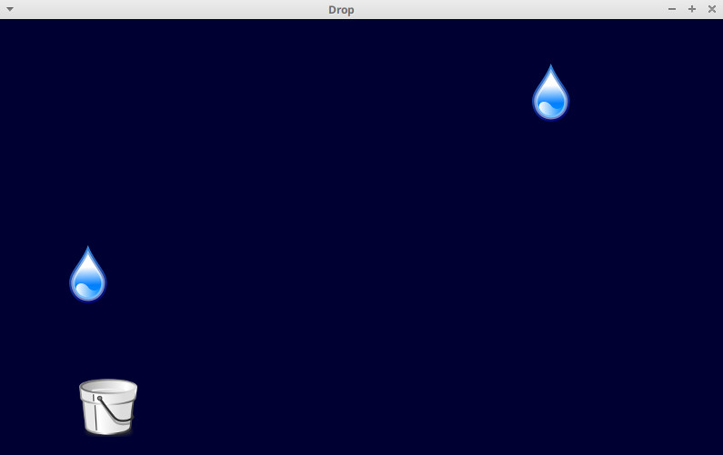
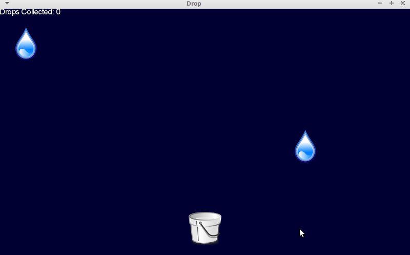

# drop
A Simple Game using LIBGDX _(LIBGDX Getting Started)_.

[Source Link](https://libgdx.com/dev/simple-game/)

## Description
The game idea is very simple:
 - Catch raindrops with a bucket.
 - The bucket is located in the lower part of the screen.
 - Raindrops spawn randomly at the top of the screen every second and accelerate downwards.
 - Player can drag the bucket horizontally via the mouse/touch or move it via the left and right cursor keys.
 - The game has no end - think of it as a zen-like experience :)

## Game play
Play game demo at: (https://drop-game-sample.herokuapp.com/)
